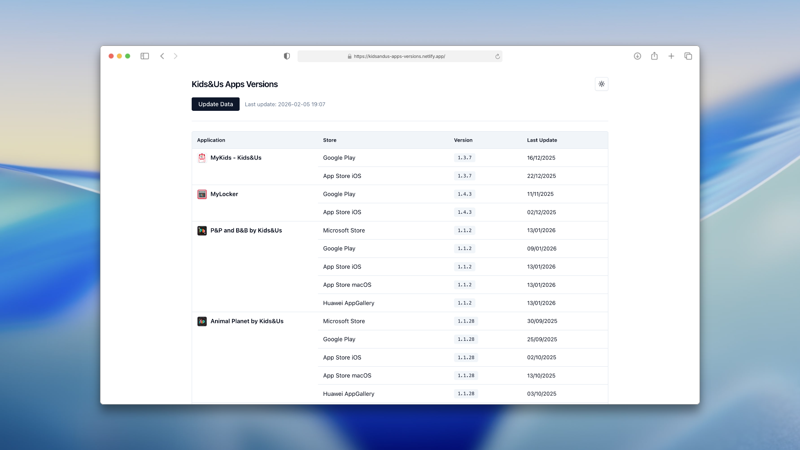
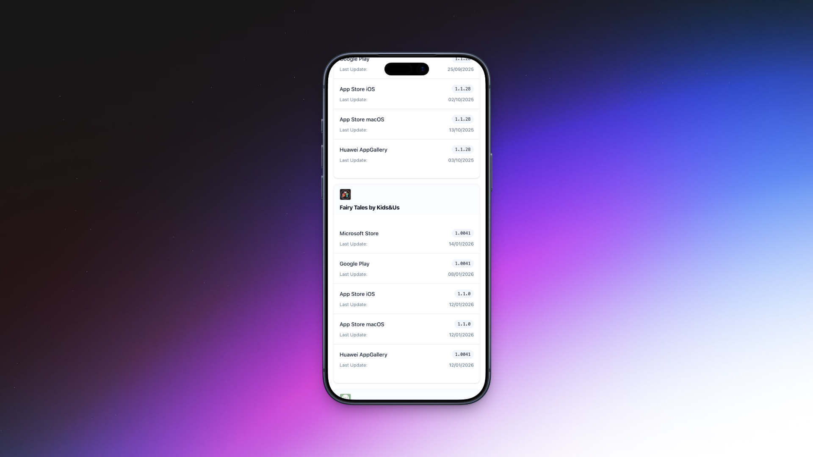

# 🚀 Kids&Us Apps Versions


[](https://github.com/marcundertest/kidsandus-apps-versions/stargazers)
[](https://github.com/marcundertest/kidsandus-apps-versions/network)
[](https://github.com/marcundertest/kidsandus-apps-versions/issues)

**A comprehensive, localized, and themeable overview of Kids&Us application versions.**

[Live Demo](https://kidsandus-apps-versions.netlify.app/)

## 📖 Overview

This repository hosts a modern web application built with Next.js and React, designed to provide a centralized and accessible overview of various Kids&Us application versions. It leverages a local `data.json` file as its primary source of information, presenting the data through a responsive and themeable user interface. The application features internationalization support, allowing for easy adaptation to different languages and providing a tailored user experience.

## ✨ Features

- **Centralized App Version Display:** Effortlessly view and manage all Kids&Us application versions data sourced from a simple `data.json` file.
- **Smart Data Update:** Manual data refresh capability with built-in cooldowns and clear loading feedback to prevent API spam.
- **Internationalization (i18n):** Supports multiple languages for content, ensuring accessibility and relevance for diverse users.
- **Theme Switching:** Seamlessly switch between light and dark modes for a personalized viewing experience.
- **Responsive Design:** Optimized for various screen sizes and devices, providing a consistent and intuitive interface across desktops, tablets, and mobile phones.
- **Local Data API:** Exposes a basic Next.js API route (`/api`) to programmatically access the application version data.
- **Modern UI Components:** Built with Shadcn/ui, offering a collection of accessible and customizable UI components for a polished user interface.

## 🖥️ Screenshots




## 🛠️ Tech Stack

**Frontend:**


**Runtime:**


**Package Manager:**


**Code Quality:**


**Deployment:**


## 🚀 Quick Start

Follow these steps to get the development environment up and running.

### Prerequisites

- **Node.js**: (version 18.17.0 or higher)
- **npm**: (Node Package Manager)

### Installation

1. **Clone the repository**

   ```bash
   git clone https://github.com/marcundertest/kidsandus-apps-versions.git
   cd kidsandus-apps-versions
   ```

2. **Install dependencies**

   ```bash
   npm install
   ```

3. **Start development server**

   ```bash
   npm run dev
   ```

4. **Open your browser**
   Visit `http://localhost:3000` (or the port specified in your terminal) to view the application.

## 📁 Project Structure

```text
kidsandus-apps-versions/
├── .gitignore
├── .prettierrc
├── components.json
├── data.json
├── eslint.config.mjs
├── netlify.toml
├── next.config.ts
├── package-lock.json
├── package.json
├── postcss.config.mjs
├── public/
│   ├── next.svg
│   └── vercel.svg
├── src/
│   ├── app/
│   │   ├── [lang]/
│   │   │   ├── layout.tsx
│   │   │   └── page.tsx
│   │   └── api/
│   │       └── route.ts
│   ├── components/
│   │   ├── card.tsx
│   │   ├── language-switcher.tsx
│   │   ├── theme-provider.tsx
│   │   └── ui/
│   │       ├── button.tsx
│   │       ├── sheet.tsx
│   │       ├── skeleton.tsx
│   │       └── table.tsx
│   ├── hooks/
│   │   └── use-theme.ts
│   ├── lib/
│   │   └── utils.ts
│   └── styles/
│       └── globals.css
└── tsconfig.json
```

## ⚙️ Configuration

### Configuration Files

- `next.config.ts`: Main configuration for Next.js, including image optimization, routing, and more.
- `postcss.config.mjs`: Configuration for PostCSS plugins, primarily used by Tailwind CSS.
- `eslint.config.mjs`: ESLint configuration for maintaining code quality and style.
- `.prettierrc`: Prettier configuration for consistent code formatting.
- `components.json`: Configuration file used by Shadcn/ui for component alias resolution.
- `tsconfig.json`: TypeScript compiler configuration.

## 🔧 Development

### Available Scripts

| Command         | Description                                        |
|-----------------|----------------------------------------------------|
| `npm run dev`   | Starts the development server                      |
| `npm run build` | Compiles the application for production deployment |
| `npm run start` | Starts the production server                       |
| `npm run lint`  | Runs ESLint to check for code quality issues       |

### Development Workflow

The standard Next.js development workflow is followed:

1. Make changes to the source code in `src/`.
2. The development server (started with `npm run dev`) will automatically reload with changes.
3. Ensure code adheres to ESLint and Prettier standards by running `npm run lint`.

## 🚀 Deployment

### Production Build

To create an optimized production build of the application:

```bash
npm run build
```

This command generates the production-ready assets in the `.next` directory.

### Deployment Options

This application is designed to be easily deployable to platforms like Netlify, Vercel, or any Node.js compatible hosting environment.

- **Netlify/Vercel**: The `npm run build` command creates the necessary output for static site hosting (if using static export) or serverless functions for API routes and SSR. Deployment can be automated by connecting your GitHub repository.
  - The repository's `homepage` metadata indicates it's deployed on Netlify: [https://kidsandus-apps-versions.netlify.app/](https://kidsandus-apps-versions.netlify.app/)

## 📚 API Reference

The application provides a basic API endpoint to access its data.

### Endpoints

#### `GET /api`

- **Description:** Retrieves the application version data. This endpoint typically serves the content of the `data.json` file.
- **Response:** JSON array containing the application version objects.
- **Example:**

  ```javascript
  fetch('/api')
    .then(response => response.json())
    .then(data => console.log(data));
  ```

## 🤝 Contributing

We welcome contributions! Please feel free to open issues or submit pull requests.

### Development Setup for Contributors

The development setup is straightforward as described in the [Quick Start](#-quick-start) section. Ensure all ESLint and Prettier checks pass before submitting a pull request.

## 📄 License

This project has an **Unspecified** license. Please contact the repository owner for licensing information.

## 🙏 Acknowledgments

- Built with [Next.js](https://nextjs.org/)
- Styled with [Tailwind CSS](https://tailwindcss.com/)
- UI components powered by [Shadcn/ui](https://ui.shadcn.com/)

## 📞 Support & Contact

- 🐛 Issues: [GitHub Issues](https://github.com/marcundertest/kidsandus-apps-versions/issues)
- 📧 For general inquiries, please refer to the repository owner's profile: [marcundertest](https://github.com/marcundertest)

---

**⭐ Star this repo if you find it helpful!**

Made with ❤️ by [marcundertest](https://github.com/marcundertest)
